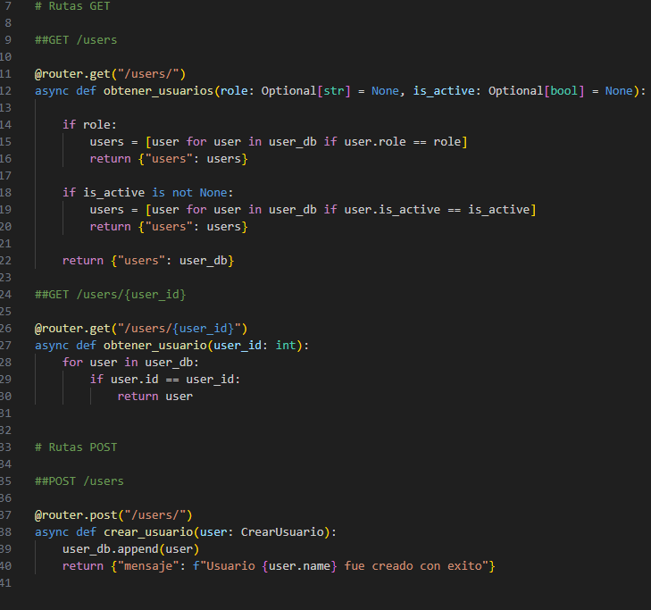

# Device systems 

## Descripcion

device systems es una app sencila de python + fastAPI donde se puede ejecutar un servidor y hacer a este peticiones GET y POST, usa un modelo de Usuario para hacer estas peticiones y esta pensado en expandirse con el pasar de las clases.

## Pasos antes de ejecutar el servidor

### Activacion entorno virtual

se debe crear un entorno virtual con python -m venv "nombre_entorno", activar el entorno segun el sistema operativo.

### Instalacion de dependencias

usando pip install -r requirements.txt dentro del entorno virtual vamos a instalar las dependencias necesarias para la app, en este caso fastapi, uvicorn y pydantic[email]

## Ejecucion del servidor

gracias a uvicorn podemos ejecutar el servidor de la app sin muchos problemas usando uvicorn app.main:app --reload, esto nos dara la direccion para entrar directamente o para utilizara en thunder client para hacer peticiones

## Tabla de endpoints

esta app tiene 3 endpoints, GET /users/ para ver todos los usuarios o filtrarlos segun el rol o si esta activo GET /users/{id} para filtrar el usuario segun la id y POST /users/ para enviar usuarios.

## Peticiones en ThunderCLient

